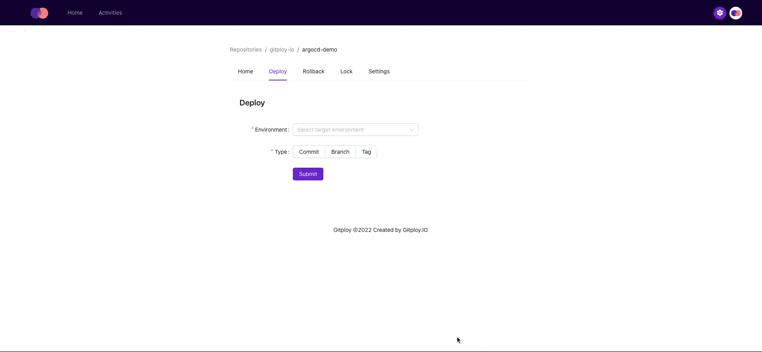

# ArgoCD Demo

## Overview

The repository demonstrates the integration with ArgoCD. Especially, the repository takes commit pinning for the deployment strategy.



## Step 0: Install Argo CD

You should install the Argo CD following the instructions in the official [documentation](https://argo-cd.readthedocs.io/en/stable/getting_started/#1-install-argo-cd), and also install CLI to interact with Argo CD.


## Step 1: Create An Application

The repository includes Kubernetes resources under the `app` directory, and Kubernetes resources are customized for each environment with [Kustomize](https://kubectl.docs.kubernetes.io/guides/introduction/kustomize/). We make Argo CD Applications for each environment with the `app` directory, respectively.

To access the Argo CD server, port-forward the pod and log in:

```shell
kubectl port-forward svc/argocd-server -n argocd 8080:8080
```

```shell
argocd login localhost:8080 --insecure --username admin --password XXXXXX
```

We're going to create an Argo CD Application for each environment, and we append the environment to the Application name as a suffix (e.g., `-dev`, `-prod`):

```shell
argocd app create argocd-demo-dev \
    --repo https://github.com/gitploy-io/argocd-demo.git \
    --path app/overlays/dev  \
    --dest-server https://kubernetes.default.svc \
    --dest-namespace argocd
```

```shell
argocd app create argocd-demo-prod \
    --repo https://github.com/gitploy-io/argocd-demo.git \
    --path app/overlays/prod  \
    --dest-server https://kubernetes.default.svc \
    --dest-namespace argocd
```

## Step 2: Set up a deployment pipeline

We're going to build the deployment pipeline with GitHub actions. The pipeline updates the Application revision and the docker image tag with the commit SHA, and it executes synchronization. Note that revision is the commit SHA for commit pinning. For details, check the Github action file below.


<details>
<summary>.github/workflow/deploy.yaml</summary>

```yaml
...
      - 
        name: Log in
        uses: clowdhaus/argo-cd-action/@main
        with:
          version: 2.3.3
          command: login gitploy.jp.ngrok.io
          options: >
            --username 
            admin 
            --password 
            ${{ secrets.ARGOCD_PASSWORD }}
      - 
        name: Set image tag
        uses: clowdhaus/argo-cd-action/@main
        with:
          version: 2.3.3
          command: app set ${{ github.event.deployment.payload.application }}
          options: >
            --revision ${{ github.sha }}  
            --kustomize-image gitployio/argocd-demo=gitployio/argocd-demo:sha-${{ github.sha }}
      - 
        name: Sync
        uses: clowdhaus/argo-cd-action/@main
        with:
          version: 2.3.3
          command: app sync ${{ github.event.deployment.payload.application }}
          options: --timeout 3600
...
```

</details>

*I used `ngrok` to connect with the local Argo CD server.*

## Question

If you have any questions, please leave them in the [community](https://github.com/gitploy-io/gitploy/discussions).
